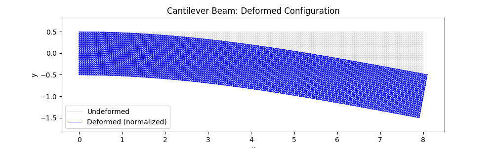
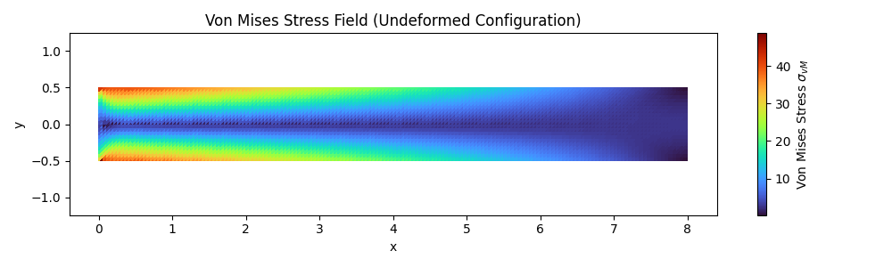
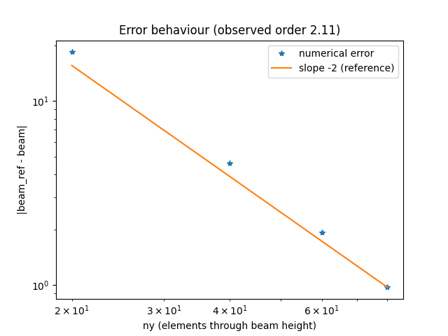

# 2D Linear Elasticity — Cantilever Beam (FEM, P1)

A from-scratch P1 finite element solver for a cantilever beam under a distributed shear load, validated against the Timoshenko beam solution.

$$-\nabla\cdot\boldsymbol\sigma(\mathbf u)=\mathbf 0 \ \text{in }\Omega, \qquad \boldsymbol\sigma=\mathbf C:\boldsymbol\varepsilon(\mathbf u), \qquad \mathbf u=\mathbf 0 \text{ on } x=0, \qquad \boldsymbol\sigma\mathbf n=(0,t_y(y)) \text{ on } x=L$$

Rectangular domain $\Omega=[0,L]\times[-h/2,h/2]$, plane-strain isotropic elasticity, P1 triangular elements, sparse assembly, no external mesh generator (mesh is built structured, in-code).

## Results

**Deformed configuration** (normalized displacement, load pushes the tip upward since `t_y(y) ≥ 0` everywhere on the loaded edge, but plotted downward for a better understanding):

**Von Mises stress field** — maximum at the clamped end, top and bottom fibers, as expected for a bent beam:

**Self-convergence** (error against a fine-mesh reference solution, not against Timoshenko — see note below): observed order ≈ 2.1, matching P1 theory.

## Comparison against Timoshenko formula

The comparison against the classical Timoshenko formula
$$\delta = \frac{PL^3}{3EI}+\frac{PL}{GA_s}$$
converges to a 9% discrepancy that does not vanish with mesh refinement. This is because Timoshenko's theory assumes a uniaxial stress state ($\sigma_{yy}=0$), while the solver uses full plane-strain elasticity, where $\sigma_{xx}$ and $\sigma_{yy}$ are coupled through $\nu$. Under plane strain, the effective bending stiffness uses $E/(1-\nu^2)$ instead of $E$. With this substitution, the discrepancy is reduced to <1%. The "self-convergence" plot isolates pure discretization error from this modeling difference by comparing against a fine-mesh solution of the same model.

## Known limitation

Standard P1 (constant-strain) triangles exhibit shear locking in bending problems, since the element cannot represent the quadratic in-plane displacement field of pure bending. Increasing "ny" (elements through the beam height) reduces it further.

## References

- S.P. Timoshenko, J.N. Goodier, *Theory of Elasticity*, McGraw-Hill.
- A. Ern, J.-L. Guermond, *Theory and Practice of Finite Elements*, Springer, 2004.