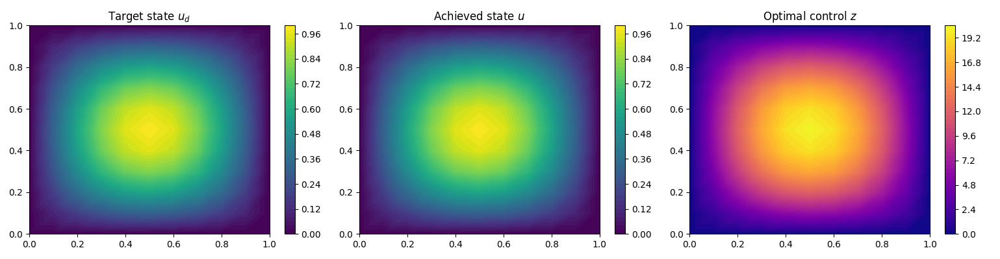
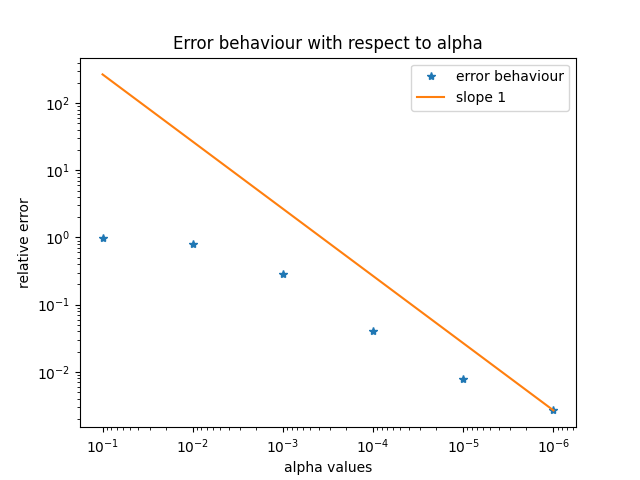

# Linear-Quadratic Optimal Control of the Poisson Equation (FEM, P1)

A from-scratch P1 finite element solver for a PDE-constrained optimization problem: choose a distributed source $z$ so that the resulting state $u$ tracks a target $u_d$, penalizing $\|z\|$.

$$\min_{u,z}\ \frac12\int_\Omega(u-u_d)^2+\frac{\alpha}{2}\int_\Omega z^2 \quad\text{s.t.}\quad -\Delta u=z,\ u=0\text{ on }\partial\Omega$$

Optimality system:
$$-\Delta u=z,\qquad -\Delta p=u-u_d,\qquad \alpha z+p=0 \qquad \text{(all with homogeneous Dirichlet BCs)}$$

solved by gradient descent on $z$: at each iteration, solve the state equation, solve the adjoint equation, form $g=\alpha z+p$, update $z\leftarrow z-\tau g$.

## Results

Target, achieved state, and optimal control with smallest $\alpha=10^{-6}$:

**Recoverability test**: reconstruction error vs. $\alpha$, on a log-log scale. The reference $z_{\text{true}}$ is computed exactly from $u_d$ (not the other way around, see below), and the theory predicts $\|z_\alpha-z_{\text{true}}\|/\|z_{\text{true}}\|\sim C\alpha$ as $\alpha\to0$ — the plot confirms slope $+1$ once $\alpha$ is small enough:

## Design choices beyond the assignment

**A fixed $\tau$ and `max_iter` did not work.** The reduced cost functional's curvature is $\alpha+\lambda_{\max}(S^*S)$, where $S=A^{-1}M$ is the solution operator of the state equation and $\lambda_{\max}(S^*S)\approx(1/2\pi^2)^2\approx2.6\times10^{-3}$ (first Laplace eigenvalue on the unit square is $\lambda_1=2\pi^2$). For $\alpha\gg2.6\times10^{-3}$ (true for most of the tested range), the curvature is dominated by $\alpha$ itself, and gradient descent's contraction factor per iteration is $\approx(1-\tau\alpha)$. This means the number of iterations needed to converge scales like $1/\alpha$, hence $\tau$ and `max_iter` tuned for $\alpha=10^{-1}$ left every smaller $\alpha$ under-iterated, converging in appearance (small `max_iter` exhausted) but not in fact.

To fix this:
- `tau = min(150, 1/alpha)` — step size scaled to the local curvature, capped at 150 (below the theoretical stability limit $\tau_{\max}\approx2/(\alpha+\lambda_{\max}(S^*S))$, which is $\approx19.5$ at $\alpha=10^{-1}$ and grows toward $\approx780$ as $\alpha\to0$).
- `max_iter = int(50/(tau*alpha))` — iteration budget scaled such that every $\alpha$ receives the right amount of iterations.
- `tol = 1e-4*alpha**2` — convergence threshold tightened for small $\alpha$, since the gradient itself scales with $\alpha$.

**Recoverability test construction.** The first version of this test picked $z_{\text{true}}$ as a random vector (`np.random.rand`) and solved forward for $u_d$. That version produced a reconstruction error flat around $0.7$–$1.0$ across the whole $\alpha$ range, showing no sign of decreasing. A plausible explanation is that a random $z_{\text{true}}$ spreads its energy across all Laplace eigenmodes roughly evenly, and high-frequency modes are suppressed in the reconstruction by a factor $1/(1+\alpha\lambda_k^2)$: for large $\lambda_k$, this factor collapses even at very small $\alpha$, so a substantial share of $z_{\text{true}}$'s energy would never be recoverable in any $\alpha$ range that is computationally reasonable to test.
 
This was confirmed by a controlled comparison: re-running the random-vector version with the current adaptive $\tau$/`max_iter`/`tol` scheme still produces a flat error curve.
 
To avoid this, we start from the actual $u_d=\sin(\pi x)\sin(\pi y)$ already used everywhere else in the script and solve backward for the exact control that reproduces it: $z_{\text{true}}=M^{-1}Au_d$. This avoids the high-frequency problem entirely, and the resulting test is well-posed over the whole tested $\alpha$ range.
 
**$\alpha$ range extended to $10^{-6}$** to show better the asymptotic $\|z_\alpha-z_{\text{true}}\|\sim C\alpha$ behaviour.
 
## Validation
 
**Gradient check**: finite-difference derivative of the cost vs. the adjoint-based gradient, single component, relative error $\approx6\times10^{-9}$.
 
**Recoverability**: error decays from $\approx98\%$ at $\alpha=10^{-1}$ to $\approx0.3\%$ at $\alpha=10^{-6}$, converging to slope $+1$ in log-log.

## References

- F. Tröltzsch, *Optimal Control of Partial Differential Equations: Theory, Methods and Applications*, AMS, 2010.
- M. Hinze, R. Pinnau, M. Ulbrich, S. Ulbrich, *Optimization with PDE Constraints*, Springer, 2009.